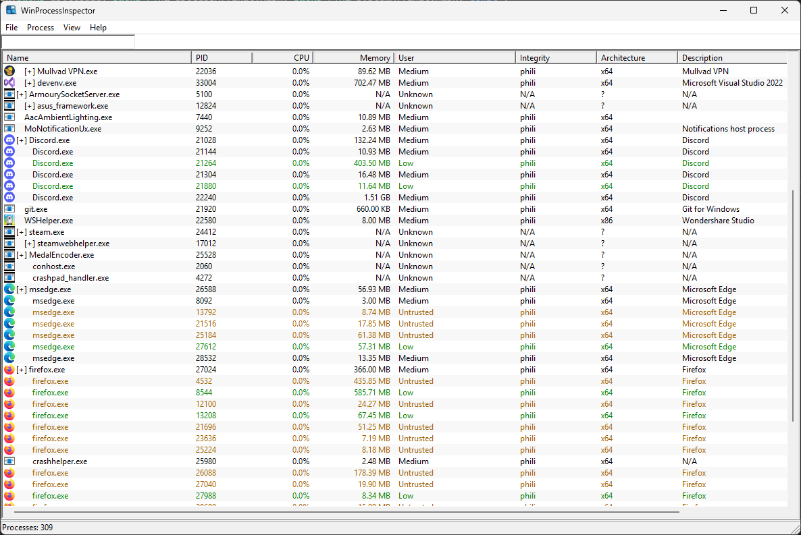

  

  
  
  
  

---

### WinProcessInspector is a Windows system inspection tool for inspecting, monitoring, and analyzing live processes, threads, memory, handles, and system resources.

---

## Features

### Process & Threads
- Full process enumeration (PID, PPID, session, integrity level)
- Thread enumeration per process
- Thread start addresses, states, priorities

### Memory & Handles
- Virtual memory region enumeration
- Memory protection and usage details
- Handle enumeration (files, registry, mutexes, events, sections)

### Modules
- Loaded DLL/module enumeration
- Base address, size, file path
- Detection of unsigned modules

### Security
- Access token inspection
- Privileges and group SIDs
- Integrity level visualization

### System Monitoring
- Per-process CPU, memory, I/O usage
- Global system metrics
- Real-time updates with minimal overhead

---

## Architecture

WinProcessInspector is built with a clean, layered architecture:

- **Core/Engine**: Windows API interaction, process/thread/module/memory/handle enumeration
- **Security**: Token, privilege, integrity, and access-rights handling
- **UI**: Native Win32 presentation layer (no system logic)
- **Utilities**: Logging, error handling, helpers

---

## How to Build and Launch WinProcessInspector

### 1. Build the Executable
- Open `WinProcessInspector.sln` in **Visual Studio**.
- Set the build configuration to **Release x64**.
- Build the solution (`Build` → `Build Solution`).
- Locate the compiled executable in the `\x64\Release\` directory.

### 2. Run WinProcessInspector
- Double-click `WinProcessInspector.exe` to launch it.
- The application will enumerate running processes automatically.

### 3. Use the Tool
- Select a process from the list to inspect its runtime state.
- Access modules, threads, memory, handles, and security information through the native UI.

---

  

